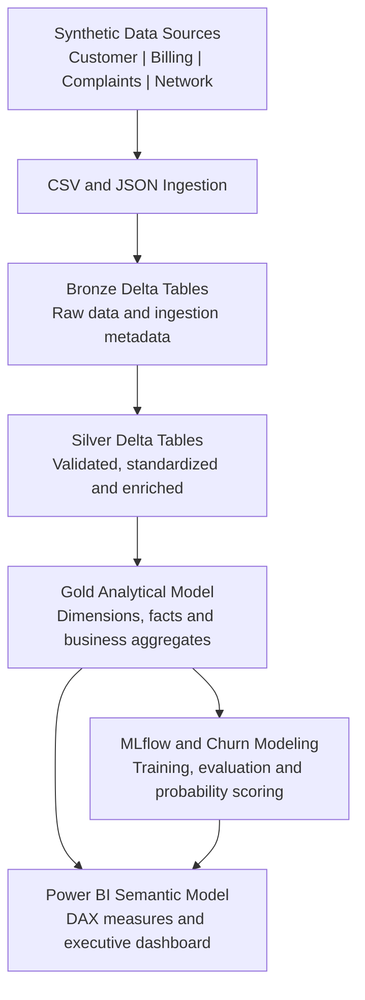
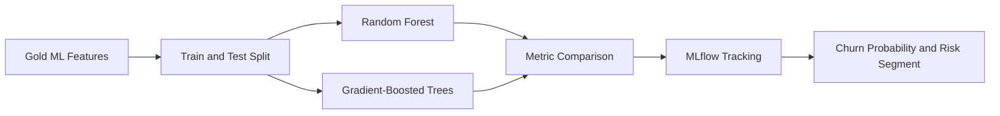

# TelecoPulse-CX

## End-to-End Telecom Customer Intelligence Platform

[](https://www.python.org/)
[](https://www.databricks.com/)
[](https://spark.apache.org/)
[](https://powerbi.microsoft.com/)
[](https://mlflow.org/)

TelecoPulse-CX is a portfolio-grade data platform that combines **Data Engineering, Data Analytics, Business Intelligence, and Machine Learning** in one telecom customer intelligence use case.

The project integrates customer, billing, complaints, and fixed-access network data; processes it through a Databricks Medallion Lakehouse; creates business-ready analytical models; trains churn classification models; and exposes insights through a Power BI executive dashboard.

> **Data privacy notice:** This project uses entirely synthetic data created for learning and portfolio demonstration. It does not contain data from Telecom Egypt, any employer, or any real telecom customer. California locations and geospatial coordinates are also synthetic and used only for visualization.

---

## Dashboard Preview


The report is stored as a **Power BI Project (PBIP)** so that the report definition, semantic model, DAX measures, relationships, and visual configuration can be version-controlled as text-based files.

---

## Business Problem

Telecom decision-makers need a consolidated view of customer behavior, revenue collection, service quality, complaints, and churn risk. These data domains are normally separated across CRM, billing, customer care, and network systems.

TelecoPulse-CX brings them together to answer questions such as:

- How many customers are active or churned?
- Which contracts and customer segments experience the highest churn?
- How much billed revenue has been collected or remains outstanding?
- Which network locations have the most incidents and affected customers?
- Are complaints being resolved within the 48-hour SLA?
- Which active customers have the highest predicted churn probability?
- Which retention actions protect the greatest amount of revenue?

---

## Solution Architecture



The current implementation uses **batch ingestion** from generated CSV and JSON files. Kafka and real-time streaming are roadmap items and are not claimed as part of the implemented version.

---

## Generated Data Sources

| Domain | Example content | Generated records |
|---|---|---:|
| Customer / CRM | Customer profile, contract, services, tenure and churn status | 7,043 |
| Billing | Monthly invoices, payments, charges and collection status | 84,516 |
| Complaints | Complaint category, priority, status, resolution time and satisfaction | 5,637 |
| Network events | Fixed-access incidents, latency, speed, packet loss and affected customers | 30,000 |

The source-generation process is reproducible through `src/generate_data_sources.py`. Curated dashboard totals can be lower than generated totals after data-quality rules, filtering, and enrichment.

---

## Medallion Lakehouse

### Bronze - Raw ingestion

- Ingests heterogeneous CSV and JSON sources
- Applies explicit PySpark schemas and permissive parsing
- Preserves raw values for traceability
- Adds source-system and ingestion timestamps
- Adds record-level metadata and hashes for auditing and deduplication
- Stores data in Delta format

### Silver - Cleaned and enriched

- Standardizes column names and data types
- Handles nulls and invalid records
- Removes duplicates using business keys and record hashes
- Applies data-quality and validation rules
- Normalizes business categories and status values
- Enriches customer, billing, complaint, and network attributes

### Gold - Business-ready analytics

- Creates reusable dimensions and fact tables
- Produces customer-level analytical features
- Builds executive KPI and performance aggregates
- Supplies curated tables to Power BI and the churn workflow
- Uses a galaxy-style model with shared dimensions and multiple fact tables

Key Gold objects include:

```text
dim_customer
dim_date
dim_network_location
fact_billing
fact_complaints
fact_network_events
customer_churn_analytics
customer_ml_features
customer_churn_predictions
high_risk_customers
executive_kpis
network_performance_by_region
ml_feature_importance
ml_model_performance
revenue_risk_by_segment
```

---

## Databricks Notebooks

Run the notebooks in the following order:

| Order | Notebook | Purpose |
|---:|---|---|
| 1 | `00_project_setup.py` | Creates the project schemas, storage objects, and environment configuration |
| 2 | `01_bronze_ingestion.py` | Ingests raw customer, billing, complaints, and network data into Bronze Delta tables |
| 3 | `02_silver_transformation.py` | Cleans, validates, standardizes, deduplicates, and enriches source records |
| 4 | `03_gold_analytics.py` | Builds dimensions, facts, Customer 360 features, KPIs, and Power BI tables |
| 5 | `03c_fixed_access_network_enrichment.py` | Improves fixed-access network characteristics and regional performance variation |
| 6 | `03d_california_geospatial_enrichment.py` | Adds synthetic California geography, latitude, and longitude for Azure Maps |
| 7 | `04_churn_ml.py` | Trains and evaluates churn classifiers, tracks experiments, and writes predictions |

---

## Machine Learning Workflow

The churn use case is implemented as a binary classification workflow for structured customer data.



Implemented ML concepts include:

- Feature engineering from customer, billing, complaint, and network domains
- Categorical feature encoding and vector assembly
- Random Forest and Gradient-Boosted Tree classifiers
- Precision, recall, F1, and ROC-AUC evaluation
- Feature importance analysis
- MLflow experiment tracking
- Customer-level churn probability scoring
- Retention priority and revenue-at-risk analysis

### Model validation status

The ML workflow is implemented for portfolio demonstration. Final threshold calibration, train/test validation, class-balance review, and data-leakage checks remain explicit refinement items before treating the model as production-ready. No dashboard metric is presented as a real-world production benchmark.

---

## Power BI Dashboard

The single-page dashboard is organized into four business sections:

### Customer Intelligence

- Total, active, and churned customers
- Customer status by contract type
- Retention and churn by tenure segment
- Internet service and contract distribution

### Revenue Performance

- Active monthly recurring revenue
- Revenue collection status
- Invoice collection efficiency
- Monthly billed, collected, and outstanding revenue
- Outstanding revenue drivers

### Service Operations

- Network event distribution
- Download speed and latency by region
- Packet loss and affected customers
- Synthetic California network incident mapping
- Complaint volume, status, resolution time, and 48-hour SLA compliance

### Predictive Churn Intelligence

- Predicted churn risk distribution
- Model prediction outcomes
- Churn drivers and feature importance
- Revenue at risk by retention action and priority

The Power BI implementation includes:

- PBIP project format
- TMDL semantic model definitions
- PBIR report definitions
- DAX measures and business KPIs
- Shared customer and date dimensions
- Azure Maps with GeoJSON resources
- Git-friendly version control for measures, relationships, and visuals

---

## Technology Stack

| Layer | Technologies |
|---|---|
| Development | VS Code, Git, GitHub |
| Data generation | Python, pandas, NumPy |
| Data engineering | Databricks, PySpark, Spark SQL, Delta Lake |
| Data modeling | Medallion Architecture, dimensional modeling, Delta tables |
| Machine learning | Spark ML, Random Forest, Gradient-Boosted Trees, MLflow |
| Business intelligence | Power BI, Power Query, DAX, PBIP, TMDL, PBIR, Azure Maps |

---

## Repository Structure

```text
telecom-customer-intelligence/
|-- config/                       # Project configuration
|-- dashboards/                   # Power BI PBIP project
|   |-- TelecoPulse-CX Dashboard.pbip
|   |-- TelecoPulse-CX Dashboard.Report/
|   `-- TelecoPulse-CX Dashboard.SemanticModel/
|-- data/                         # Generated/local data zones
|-- databricks/                   # Exported Databricks notebook source
|-- docs/                         # Documentation and dashboard images
|-- sql/                          # SQL scripts and analytical queries
|-- src/
|   `-- generate_data_sources.py  # Reproducible synthetic data generator
|-- tests/                        # Project tests
|-- .gitignore
|-- requirements.txt
`-- README.md
```

Power BI cache files and machine-specific settings are excluded from version control:

```gitignore
**/.pbi/localSettings.json
**/.pbi/cache.abf
```

---

## Running the Project

### 1. Clone the repository

```bash
git clone https://github.com/mahmoudmohamedmahmoudhelmy/telecom-customer-intelligence.git
cd telecom-customer-intelligence
```

### 2. Create the local Python environment

```powershell
python -m venv .venv
.\.venv\Scripts\Activate.ps1
pip install -r requirements.txt
```

### 3. Generate the synthetic source data

```powershell
python src/generate_data_sources.py
```

### 4. Run the Databricks pipeline

Import the files from `databricks/` into a Databricks workspace and execute them in the documented order from `00_project_setup.py` through `04_churn_ml.py`.

### 5. Open the Power BI project

Open:

```text
dashboards/TelecoPulse-CX Dashboard.pbip
```

Refresh credentials and data-source connections for your own Databricks environment when required.

---

## Current Status and Roadmap

### Implemented

- Reproducible multi-source synthetic data generation
- Batch ingestion using CSV and JSON
- Bronze, Silver, and Gold Delta Lake pipeline
- Data quality, validation, enrichment, and record metadata
- Dimensional analytical model
- Fixed-access network and geospatial enrichment
- Power BI PBIP semantic model and executive dashboard
- Churn modeling workflow and MLflow experiment tracking

### Planned improvements

- Complete final churn-model leakage review and threshold calibration
- Add automated unit and data-quality tests to CI
- Orchestrate notebook execution with Databricks Workflows
- Add pipeline monitoring and failure alerts
- Evaluate Kafka and Structured Streaming as a future real-time ingestion path
- Add model serving and scheduled prediction refresh

---

## Author

**Mahmoud Helmy**  
PMO, Business Performance, Data Analytics, Data Engineering, and AI/ML  
[GitHub](https://github.com/mahmoudmohamedmahmoudhelmy) | [LinkedIn](https://www.linkedin.com/in/mahmoud-helmy-55759b1aa)

---

If you find this project useful, consider starring the repository.
